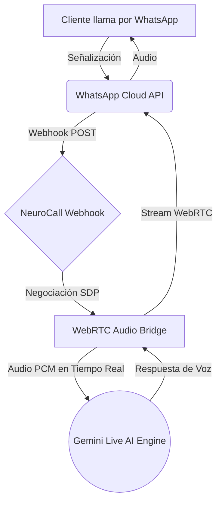

# NeuroCall — WhatsApp Voice SDK

<p align="center">
  
  
  
  
  
</p>

> **SDK de grado empresarial para desplegar agentes de voz con Inteligencia Artificial a través de WhatsApp Business.**  
> Desarrollado y mantenido por **[NEURO IA S.A.S.](https://wa.me/593987865420)**

---

## 🚀 ¿Qué es NeuroCall?

NeuroCall es un motor de comunicación de voz en tiempo real diseñado para integrarse nativamente con la API de **WhatsApp Business**. Mediante el uso de WebRTC y WebSockets, NeuroCall captura flujos de audio en directo, los procesa a través de la API multimodal de **Google Gemini Live**, y genera respuestas fluidas y conversacionales con una latencia inferior a un segundo.

### Arquitectura del Flujo de Voz



---

## 🛠️ Stack Tecnológico

La plataforma está construida utilizando estándares modernos para garantizar alta disponibilidad y baja latencia:

| Capa | Tecnología Principal |
|---|---|
| **Core & Servidor** | Node.js, Express.js |
| **Streaming en Tiempo Real** | WebRTC (`node-datachannel`), Socket.IO |
| **Motor de Inteligencia Artificial**| Google Gemini Live API |
| **Capa de Mensajería** | Meta Webhooks (WhatsApp Cloud API) |
| **Persistencia de Datos** | PostgreSQL / SQLite (Configurable) |
| **Interfaz de Administración** | HTML5, Vanilla JS, CSS3 |

---

## 📂 Estructura del Proyecto

```text
whatsapp-voice-sdk_dev/
├── backend/
│   ├── server.js                    # Servidor principal (Express & WebSockets)
│   ├── database.js                  # Conector de persistencia (PostgreSQL/SQLite)
│   ├── services/
│   │   ├── geminiLiveBridge.js      # Integración y puente de audio bidireccional con Gemini
│   │   └── whatsappCallManager.js   # Gestión de ciclo de vida de llamadas WebRTC
│   ├── .env.example                 # Variables de entorno
│   └── package.json                 # Dependencias del backend
└── frontend/
    ├── dashboard.html               # Panel de control del sistema
    ├── app.js                       # Lógica de la interfaz de usuario
    ├── styles.css                   # Hoja de estilos del dashboard
    └── desarrolladores.html         # Documentación de integración interactiva
```

---

## ⚡ Instalación y Despliegue

### Requisitos Previos

1. **Node.js**: Versión 18.x o superior.
2. **Cuenta de Meta for Developers**: Con acceso a WhatsApp Business API.
3. **Google Cloud Console**: API Key activa con acceso a Gemini Live.
4. **Exposición a Internet**: Servidor con IP pública o túnel inverso (Cloudflare Tunnel, Ngrok, etc.).

### 1. Clonar el Repositorio

```bash
git clone https://github.com/gglveliz-byte/whatsapp-voice-sdk_dev.git
cd whatsapp-voice-sdk_dev/backend
```

### 2. Instalación de Dependencias

```bash
npm install
```

### 3. Configuración de Entorno

Duplica el archivo de ejemplo para crear tu configuración local:

```bash
cp .env.example .env
```

Edita el archivo `.env` para añadir tus credenciales (pueden ser configuradas más tarde vía el Dashboard):

```env
# Configuración del Servidor
PORT=3006

# Las credenciales de Meta y Gemini pueden configurarse vía interfaz web.
```

### 4. Inicializar el Servidor

```bash
npm start
```
El servidor se iniciará en `http://localhost:3006`. Para gestionar la plataforma, accede a la consola de administración en:
👉 `http://localhost:3006/dashboard.html`

---

## ⚙️ Configuración del Webhook en Meta

Para que las llamadas de WhatsApp lleguen a tu instancia de NeuroCall, debes configurar el Webhook en el portal de Meta:

1. Ingresa a [Meta for Developers](https://developers.facebook.com).
2. Selecciona tu aplicación y navega a **WhatsApp > Configuración**.
3. En la sección **Webhook**, haz clic en *Editar*.
4. **URL de devolución de llamada**: Ingresa tu dominio público seguido de la ruta de la API (ej. `https://tu-dominio.com/api/webhook`).
5. **Token de verificación**: Ingresa el token configurado en tu plataforma (por defecto: `whatsapp_voice_sdk_verify_token`).
6. En la lista de **Campos del Webhook (Webhook fields)**, asegúrate de suscribirte a los eventos `messages` y `calls`.

---

## 🎛️ Consola de Administración

NeuroCall incluye un Dashboard interactivo que permite operar la plataforma sin tocar el código:

- **🔐 Gestión de Credenciales**: Actualiza tokens de Meta y Gemini en tiempo real.
- **🛡️ Seguridad de Sesión**: Auto-destrucción y limpieza manual de sesiones para proteger tus credenciales.
- **📞 Monitoreo de Llamadas**: Observa el ciclo de vida de la negociación WebRTC y las interacciones con Gemini Live.
- **📜 Logs en Vivo**: Diagnóstico del sistema mediante consola WebSocket integrada.

---

## 🔒 Licencia y Términos de Uso

Este software se distribuye bajo **Licencia Comercial Privada**.

- ✅ **Permitido**: Uso exclusivo en instalaciones autorizadas explícitamente por **NEURO IA S.A.S.**
- ❌ **Prohibido**: Modificación, redistribución o reventa del código fuente sin autorización escrita.
- ❌ **Prohibido**: Ingeniería inversa para la creación de soluciones competidoras.
- ❌ **Prohibido**: Uso del sistema para actividades ilícitas, de fraude, spam o acoso.

Para adquirir una licencia comercial, integraciones personalizadas o soporte empresarial:  
📩 **[Contactar a NEURO IA S.A.S.](https://wa.me/593987865420)**

---

<p align="center">
  Desarrollado con ❤️ por <strong>NEURO IA S.A.S.</strong><br>
  © 2026 — Todos los derechos reservados.
</p>
