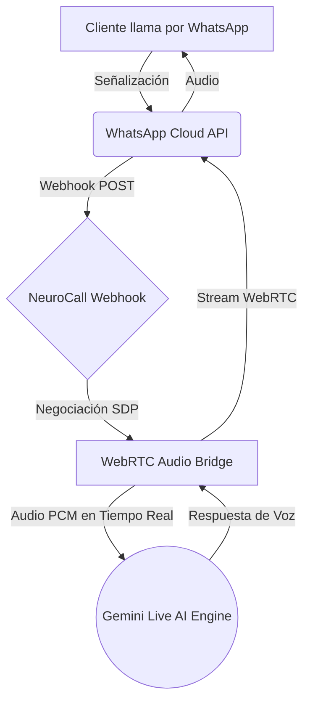
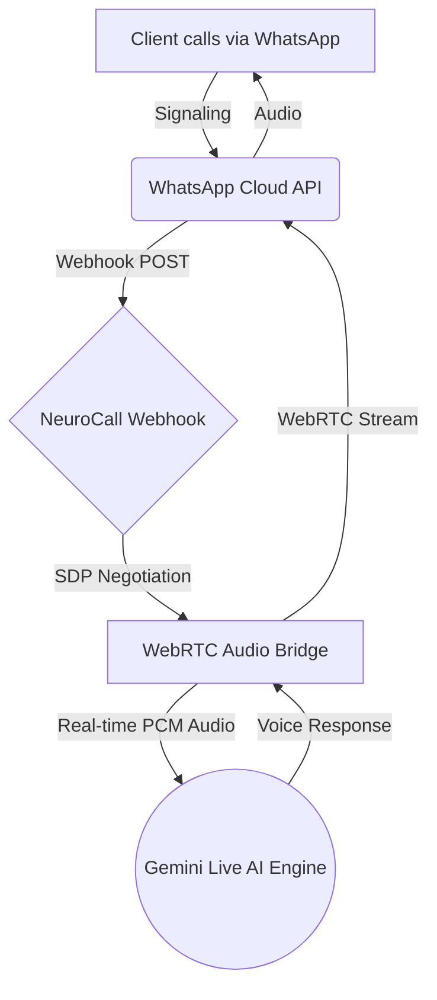

# NeuroCall — WhatsApp Voice SDK

<p align="center">
  
  
  
  
  
</p>

<p align="center">
  <strong>🇪🇸 Español</strong> • <a href="#-english"><strong>🇬🇧 English</strong></a>
</p>

---

## 🇪🇸 Español

> **SDK de grado empresarial para desplegar agentes de voz con Inteligencia Artificial a través de WhatsApp Business.**  
> Desarrollado y mantenido por **[NEURO IA S.A.S.](https://wa.me/593987865420)**

### 🚀 ¿Qué es NeuroCall?

NeuroCall es un motor de comunicación de voz en tiempo real diseñado para integrarse nativamente con la API de **WhatsApp Business**. Mediante el uso de WebRTC y WebSockets, NeuroCall captura flujos de audio en directo, los procesa a través de la API multimodal de **Google Gemini Live**, y genera respuestas fluidas y conversacionales con una latencia inferior a un segundo.

### Arquitectura del Flujo de Voz



### 🛠️ Stack Tecnológico

| Capa | Tecnología Principal |
|---|---|
| **Core & Servidor** | Node.js, Express.js |
| **Streaming en Tiempo Real** | WebRTC (`node-datachannel`), Socket.IO |
| **Motor de Inteligencia Artificial**| Google Gemini Live API |
| **Capa de Mensajería** | Meta Webhooks (WhatsApp Cloud API) |
| **Persistencia de Datos** | PostgreSQL / SQLite (Configurable) |
| **Interfaz de Administración** | HTML5, Vanilla JS, CSS3 |

### 📂 Estructura del Proyecto

```text
whatsapp-voice-sdk_dev/
├── backend/
│   ├── server.js                    # Servidor principal (Express & WebSockets)
│   ├── database.js                  # Conector de persistencia (PostgreSQL/SQLite)
│   ├── services/
│   │   ├── geminiLiveBridge.js      # Integración y puente de audio bidireccional con Gemini
│   │   └── whatsappCallManager.js   # Gestión de ciclo de vida de llamadas WebRTC
│   ├── .env.example                 # Variables de entorno
│   └── package.json                 # Dependencias del backend
├── frontend/
│   ├── dashboard.html               # Panel de control del sistema
│   ├── desarrolladores.html         # Documentación de integración interactiva
│   ├── app.js                       # Lógica de la interfaz de usuario
│   ├── lang.js                      # Sistema de traducción bilingüe ES/EN
│   └── styles.css                   # Hoja de estilos del dashboard
└── README.md
```

### ⚡ Instalación y Despliegue

#### Requisitos Previos

1. **Node.js**: Versión 18.x o superior.
2. **Cuenta de Meta for Developers**: Con acceso a WhatsApp Business API.
3. **Google Cloud Console**: API Key activa con acceso a Gemini Live.
4. **Exposición a Internet**: Servidor con IP pública o túnel inverso (Cloudflare Tunnel, Ngrok, etc.).

#### 1. Clonar el Repositorio

```bash
git clone https://github.com/gglveliz-byte/whatsapp-voice-sdk_dev.git
cd whatsapp-voice-sdk_dev/backend
```

#### 2. Instalación de Dependencias

```bash
npm install
```

#### 3. Configuración de Entorno

```bash
cp .env.example .env
```

Edita el archivo `.env` para añadir tus credenciales:

```env
# Configuración del Servidor
PORT=3006

# Las credenciales de Meta y Gemini pueden configurarse vía interfaz web.
```

#### 4. Inicializar el Servidor

```bash
npm start
```

El servidor se iniciará en `http://localhost:3006`. Accede a la consola de administración en:
👉 `http://localhost:3006/dashboard.html`

### ⚙️ Configuración del Webhook en Meta

1. Ingresa a [Meta for Developers](https://developers.facebook.com).
2. Selecciona tu aplicación y navega a **WhatsApp > Configuración**.
3. En la sección **Webhook**, haz clic en *Editar*.
4. **URL de devolución de llamada**: Ingresa tu dominio público seguido de la ruta de la API (ej. `https://tu-dominio.com/api/webhook`).
5. **Token de verificación**: Ingresa el token configurado en tu plataforma (por defecto: `whatsapp_voice_sdk_verify_token`).
6. En la lista de **Campos del Webhook**, suscríbete a los eventos `messages` y `calls`.

### 🎛️ Consola de Administración

- **🔐 Gestión de Credenciales**: Actualiza tokens de Meta y Gemini en tiempo real.
- **🛡️ Seguridad de Sesión**: Auto-destrucción y limpieza manual de sesiones.
- **📞 Monitoreo de Llamadas**: Ciclo de vida de negociación WebRTC y Gemini Live.
- **📜 Logs en Vivo**: Diagnóstico mediante consola WebSocket integrada.
- **🌐 Bilingüe**: Interfaz disponible en español e inglés.

### 🔒 Licencia

Este software se distribuye bajo **Licencia Comercial Privada**.

- ✅ **Permitido**: Uso exclusivo en instalaciones autorizadas explícitamente por **NEURO IA S.A.S.**
- ❌ **Prohibido**: Modificación, redistribución o reventa del código fuente sin autorización escrita.
- ❌ **Prohibido**: Ingeniería inversa para la creación de soluciones competidoras.

Para adquirir una licencia comercial:
📩 **[Contactar a NEURO IA S.A.S.](https://wa.me/593987865420)**

---

## 🇬🇧 English

> **Enterprise-grade SDK for deploying AI voice agents through WhatsApp Business.**  
> Developed and maintained by **[NEURO IA S.A.S.](https://wa.me/593987865420)**

### 🚀 What is NeuroCall?

NeuroCall is a real-time voice communication engine designed to integrate natively with the **WhatsApp Business** API. Using WebRTC and WebSockets, NeuroCall captures live audio streams, processes them through **Google Gemini Live** multimodal API, and generates fluid, conversational responses with sub-second latency.

### Voice Flow Architecture



### 🛠️ Tech Stack

| Layer | Technology |
|---|---|
| **Core & Server** | Node.js, Express.js |
| **Real-time Streaming** | WebRTC (`node-datachannel`), Socket.IO |
| **AI Engine** | Google Gemini Live API |
| **Messaging Layer** | Meta Webhooks (WhatsApp Cloud API) |
| **Data Persistence** | PostgreSQL / SQLite (Configurable) |
| **Admin Interface** | HTML5, Vanilla JS, CSS3 |

### 📂 Project Structure

Same as Español section above.

### ⚡ Installation & Deployment

#### Prerequisites

1. **Node.js**: Version 18.x or higher.
2. **Meta for Developers Account**: With WhatsApp Business API access.
3. **Google Cloud Console**: Active API Key with Gemini Live access.
4. **Internet Exposure**: Public IP or reverse tunnel (Cloudflare Tunnel, Ngrok, etc.).

#### 1. Clone the Repository

```bash
git clone https://github.com/gglveliz-byte/whatsapp-voice-sdk_dev.git
cd whatsapp-voice-sdk_dev/backend
```

#### 2. Install Dependencies

```bash
npm install
```

#### 3. Environment Setup

```bash
cp .env.example .env
```

Edit the `.env` file to add your credentials:

```env
# Server Configuration
PORT=3006

# Meta and Gemini credentials can be configured via the web interface.
```

#### 4. Start the Server

```bash
npm start
```

The server starts at `http://localhost:3006`. Access the admin console at:
👉 `http://localhost:3006/dashboard.html`

### ⚙️ Webhook Configuration in Meta

1. Go to [Meta for Developers](https://developers.facebook.com).
2. Select your app and navigate to **WhatsApp > Configuration**.
3. In the **Webhook** section, click *Edit*.
4. **Callback URL**: Enter your public domain followed by the API path (e.g., `https://your-domain.com/api/webhook`).
5. **Verify Token**: Enter the token configured in your platform (default: `whatsapp_voice_sdk_verify_token`).
6. In **Webhook Fields**, subscribe to `messages` and `calls` events.

### 🎛️ Admin Console

- **🔐 Credential Management**: Update Meta and Gemini tokens in real time.
- **🛡️ Session Security**: Auto-destruction and manual session cleanup.
- **📞 Call Monitoring**: WebRTC negotiation and Gemini Live lifecycle.
- **📜 Live Logs**: System diagnostics via integrated WebSocket console.
- **🌐 Bilingual**: Interface available in Spanish and English.

### 🔒 License

This software is distributed under a **Private Commercial License**.

- ✅ **Allowed**: Exclusive use in installations explicitly authorized by **NEURO IA S.A.S.**
- ❌ **Prohibited**: Modification, redistribution, or resale of source code without written authorization.
- ❌ **Prohibited**: Reverse engineering for creating competing solutions.

To acquire a commercial license:
📩 **[Contact NEURO IA S.A.S.](https://wa.me/593987865420)**

---

<p align="center">
  Developed with ❤️ by <strong>NEURO IA S.A.S.</strong><br>
  &copy; 2026 — All rights reserved.
</p>
